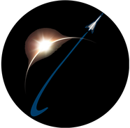

# (Insert Name) Project Documentation

**(code project name here)**  
**Version** v0.1.xx  
**Last Edited:** 7/1/21  
**License:** [GNU GPL](https://www.gnu.org/licenses/licenses.html#GPL),
[License File](LICENSE.md)

**Readme Authors:** Anthony Corneau & Nihal Kumarswamy   
**University:** The University of Texas at Arlington  
**Departments:** Aerospace and Mechanical Engineering, Industrial Engineering  
**Team Name:** Aero Mavericks, Liquid Rocket Engine Division (LRE)  
**Team Email:** aeromavs@gmail.com  
**Team Webpage:** [Aero Mavericks LRE](https://aeromavs.weebly.com/about.html)  

## Description of the project’s content

This repository contains a code project that is a lightweight, highly extensible 
application that allows for plug and play for interfacing with a Raspberry Pi 
over IP to a controller computer, with sensors connected to the Pi 

### Component Documentation

**[GUI README](gui/gui_README.md)**  

**[MC README](mc/mc_README.md)**  

**[Pi README](pi/pi_README.md)**  

For questions and troubleshooting, please contact:  
Nihal Kumarswamy  
nihal.kumarswamy@mavs.uta.edu  

> Ad Astra!